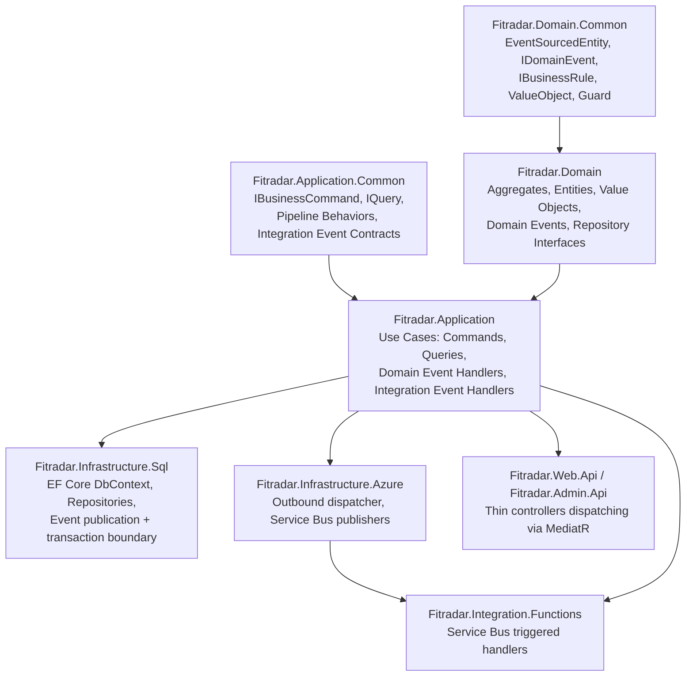
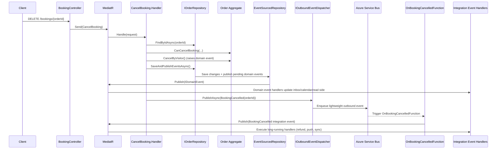

# FitRadar Architecture Showcase

Selected FitRadar .NET backend excerpts that demonstrate how DDD, CQRS, and event-driven processing are composed in one production-oriented system.

This repository is a reference for architectural and design decisions. It is intentionally not presented as a turnkey runnable product.

## Production Product Context (fitradar.me)

FitRadar is a live consumer platform currently available to end users via mobile apps and the public website:

- Product site: https://fitradar.me
- Google Play app listing: https://play.google.com/store/apps/details?id=com.fitradarlab.fitradar
- Apple App Store listing: https://apps.apple.com/app/fitradar-app/id6501984166

The production product enables users to:

- Discover nearby workouts and sports events with filters (distance, favorites, and other presets)
- Book classes/events directly from the app
- Host free or paid workouts as organizers
- Use secure payment flows with Stripe for paid bookings
- Cancel bookings under defined conditions (for example, free bookings anytime and paid bookings before a cutoff window stated on the site)
- Receive and provide ratings/feedback tied to real participation

## Why This Showcase Exists

The source solution combines several non-trivial patterns that are often explained in isolation, but here are used together:

- Clean Architecture with strict inward dependencies
- DDD aggregates with event sourcing-style pending domain events
- CQRS with MediatR request/handler pipelines
- Explicit business rule objects and evaluators
- Two-tier integration event strategy (in-process vs outbound)
- Nested handler conventions for related event workflows
- RequestCode correlation for validation and client-facing error contracts

## Architecture At A Glance

## Full Request Lifecycle (Cancel Booking)

The vertical slice below illustrates how one user action moves through command handling, domain events, and asynchronous integrations.

## Two-Tier Integration Event Strategy

The key architectural decision is to split integration events by execution semantics:

| Concern | In-Process Event (`IInProcessIntegrationEvent` / `IIntegrationEvent`) | Outbound Event (`IOutboundIntegrationEvent`) |
|---|---|---|
| Transport | MediatR in-memory notification pipeline | Azure Service Bus + Azure Functions |
| Latency budget | Fast operations (typically sub-second) | Long-running or potentially slow workflows |
| Failure model | Fails within request processing context | Independent retries and DLQ behavior |
| Coupling | Tightly coupled to application process | Loosely coupled, process boundary crossing |
| Typical use | Local projections, inbox/calendar updates, lightweight notifications | External APIs, payments, distributed orchestration |
| Payload style | Rich in-process payload | Lightweight envelope, usually IDs |

This separation prevents long or fragile external work from blocking API request/response paths while preserving simple in-process eventing for fast side effects.

## Why Two Command Types Were Introduced

The command model is intentionally split between `IBusinessCommand` and `IReadStoreCommand`.

- `IBusinessCommand` is used when a use case must execute domain behavior: calling aggregate methods, enforcing business rules, and preserving a rich domain model.
- `IReadStoreCommand` is used for operations that update only read-side/projection data and do not require domain interaction.

This separation helps avoid turning the domain layer into passive data containers. Domain entities remain behavior-rich, while read-model-only data flows stay outside the business layer and do not couple to domain objects.

## Core Design Decisions Demonstrated

1. Domain events are raised inside aggregates and accumulated as pending events.
2. Repositories own transaction boundaries and event publication ordering.
3. Controllers remain thin and only coordinate HTTP concerns and MediatR dispatch.
4. Commands carry metadata (`RequestCode`, `IgnoreWarnings`) for validation and error correlation.
5. Business invariants are expressed as dedicated rule objects/evaluators, not scattered conditionals.
6. Related event handlers are grouped as nested classes to keep a workflow cohesive.

## Pipeline Behaviors (Cross-Cutting)

MediatR pipeline behaviors implement consistent request processing policy:

- `RequestValidationBehavior`: runs FluentValidation and maps failures using `RequestCode`
- `RequestPerformanceBehavior`: warns on slow requests (threshold-based)
- `ResponseLocalizationBehavior`: localizes response DTOs through response localizers

## Representative Source References

The architecture described here is based on these concrete implementation points in the source solution:

- `Fitradar.Domain.Common/EventSourcedEntity.cs`
- `Fitradar.Domain.Common/IDomainEvent.cs`
- `Fitradar.Domain.Common/BusinessRules/IBusinessRule.cs`
- `Fitradar.Domain.Common/BusinessRules/IBusinessRulesEvaluator.cs`
- `Fitradar.Application.Common/IBusinessCommand.cs`
- `Fitradar.Application.Common/IReadStoreCommand.cs`
- `Fitradar.Application.Common/ICommandMetadata.cs`
- `Fitradar.Application.Common/IQuery.cs`
- `Fitradar.Application.Common/IInProcessIntegrationEvent.cs`
- `Fitradar.Application.Common/IOutboundIntegrationEvent.cs`
- `Fitradar.Application.Common/IOutboundEventDispatcher.cs`
- `Fitradar.Application/UseCases/Booking/Commands/CancelBooking.cs`
- `Fitradar.Infrastructure.Sql/Repositories/Base/EventSourcedRepository.cs`
- `Fitradar.Application/UseCases/Booking/DomainEventHandlers/BookingCancelledHandlers.cs`
- `Fitradar.Application/UseCases/Booking/IntegrationEvents/BookingCancelled.cs`
- `Fitradar.Application/UseCases/Booking/OutboundEvents/BookingCancelled.cs`
- `Fitradar.Integration.Functions/BookingLifecycle/OnBookingCancelledFunction.cs`

## Intended Audience

This showcase is useful for engineers and architects who want practical examples of:

- DDD aggregate modeling with explicit rule evaluation
- CQRS request pipelines with MediatR in ASP.NET Core
- Splitting synchronous and asynchronous side effects safely
- Integrating EF Core transactional writes with domain event dispatch

## Scope And Safety

Business-sensitive details are intentionally minimized. The goal is to highlight transferable architecture, not proprietary domain logic or operational secrets.
